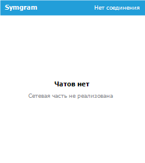
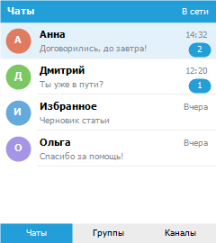

# Symgram

Нативный Telegram-клиент для **Symbian OS 9.2 / S60 3rd Edition Feature Pack 1** —
платформы Nokia N95 8GB.

<br clear="left">

## О проекте

Цель — вернуть работающий мессенджер на телефон 2007 года: приложение на Symbian C++,
которое даёт основные возможности пользовательского аккаунта Telegram, удобно управляется
клавиатурой и джойстиком N95 и выглядит узнаваемо телеграмным в рамках интерфейсных
привычек S60.

Полное техническое задание — в [docs/SPEC.md](docs/SPEC.md).

## Состояние

Работает оболочка приложения: иконка, локализация, отрисовка экрана, сборка под
устройство и упаковка в самоподписанный `.sisx`.

**Сетевого слоя нет.** Ни подключения к Telegram, ни авторизации, ни сообщений в
приложении не существует, поэтому список чатов пуст и приложение об этом прямо говорит.

| Что показывает приложение сейчас | Как список выглядит при заполнении |
| :---: | :---: |
|  |  |

Оба изображения — не снимки с устройства, а отрисовка скриптом `tools\preview-ui.ps1`
по тем же правилам раскладки, что зашиты в код: эмулятор на современных Windows не
запускается, о чём ниже. Правое изображение — **макет оформления на вымышленных данных**
из `tools\mock-chats.txt`; в сборку эти диалоги не попадают.

### Этапы

| Этап | Состояние |
| --- | --- |
| 1. Исследование совместимости MTProto и Symbian 9.2 | завершён, выводы в [ARCHITECTURE.md](docs/ARCHITECTURE.md) |
| 2. Прототип: запуск, авторизация, список чатов, текст | отрисовка списка готова, протокол не начат |
| 3. Первая версия: чаты, группы, каналы, медиа, поиск | не начат |
| 4. Расширение: управление чатами, контакты, уведомления | не начат |
| 5. Опциональное: секретные чаты, реакции, тёмная тема | не начат |
| 6. Тестирование на N95 8GB и выпуск `.sisx` | сборка и упаковка работают |

Критерии приёмки первой версии перечислены в разделе 11 технического задания.

## Планируемые возможности

Из технического задания, в порядке приоритета реализации:

- **Авторизация** по номеру телефона и коду, двухэтапная аутентификация, выход из аккаунта.
- **Список чатов**: диалоги, группы, супергруппы, каналы, сохранённые сообщения,
  закрепление, архив, поиск.
- **Переписка**: отправка и приём текста, ответы, пересылка, редактирование и удаление
  своих сообщений, статусы доставки и прочтения, подгрузка истории частями.
- **Медиа**: фотографии, видео, голосовые сообщения и документы, просмотр во весь экран,
  сохранение вложений, ограничение автозагрузки.
- **Группы и каналы**: информация, участники, права, вступление и подписка.
- **Уведомления**: локальные оповещения, настройки по чатам, фоновая проверка с
  настраиваемым интервалом, экономный режим.
- **Настройки**: точка доступа, автозагрузка по типу сети, размер кэша, шрифт, темы.

## Целевая платформа

| Параметр | Значение |
| --- | --- |
| Устройство-референс | Nokia N95 8GB |
| Операционная система | Symbian OS 9.2 |
| Интерфейсная платформа | S60 3rd Edition FP1 |
| Экран | 240 × 320, портрет и ландшафт |
| Управление | клавиатура, джойстик, софт-клавиши; без сенсора |
| Поставка | подписанный `.sisx` |

UID приложения — `0xE0A11E95`, из незащищённого диапазона, поэтому пакет можно подписывать
самостоятельно. Права `NetworkServices`, `ReadUserData`, `WriteUserData` и `UserEnvironment`
выдаются пользователем при установке, что позволяет обойтись без Symbian Signed.

## Технические решения

Исследование совместимости показало, что часть требований ТЗ невыполнима средствами
платформы. Принятые обходные пути подробно разобраны в
[docs/ARCHITECTURE.md](docs/ARCHITECTURE.md), кратко:

| Задача | Решение | Почему |
| --- | --- | --- |
| Криптография MTProto | Open C с OpenSSL 0.9.8a | в публичном SDK нет ни AES, ни SHA-256, ни RSA |
| Локальная база | SQLite поверх Open C | `RSqlDatabase` появился только в Symbian 9.3 |
| Проверка обновлений | встроенный mbedTLS | системный стек ограничен TLS 1.0, GitHub требует 1.2 |

Транспорт MTProto идёт обычным TCP, поэтому ограничение TLS его не затрагивает.

## Языки

Основной язык интерфейса — русский, дополнительный — английский. Строки вынесены
в `data/Symgram_16.rls` и `data/Symgram_01.rls`; файл `data/Symgram.rls` выбирает вариант
по коду языка телефона, а вариант по умолчанию указывает на русский.

## Сборка

Запускать из `cmd.exe`, не из PowerShell — причина описана в заметках по окружению.

```
tools\release.bat            REM сборка под устройство и упаковка в .sisx
tools\build.bat              REM только сборка, GCCE release
tools\package.bat            REM только упаковка и подпись
```

`package.bat` при первом запуске создаёт сертификат для самоподписи и дальше переиспользует
его; сертификат и ключ в репозиторий не попадают.

Вспомогательные скрипты, требующие PowerShell:

```
tools\make-icon.ps1          REM рисует иконку и её маску
tools\preview-ui.ps1 -Empty  REM отрисовывает текущий экран приложения
tools\preview-ui.ps1         REM отрисовывает макет списка на вымышленных данных
```

| Компонент | Версия |
| --- | --- |
| SDK | S60 3rd Edition FP1 SDK for Symbian OS, for C++ |
| Компилятор для устройства | GCCE — GCC 3.4.3, CodeSourcery ARM Q1C 2005 |
| Perl | ActivePerl 5.6.1 |

Как всё это установлено и какие у платформы неочевидные особенности —
в [docs/TOOLCHAIN.md](docs/TOOLCHAIN.md).

**Сборка под эмулятор недоступна.** Цель WINSCW собирается компилятором Metrowerks
CodeWarrior, который входит в состав Carbide.c++, а не SDK. Сам эмулятор к тому же падает
на современных Windows: ядро завершается с ошибкой в планировщике `ncsched.cpp`. Проверка
ведётся на устройстве.

## Установка на телефон

Телефон по умолчанию отвергает самоподписанные пакеты — нужны две настройки в диспетчере
приложений. Порядок действий и разбор типичных сбоев установки описаны в
[docs/DEVICE.md](docs/DEVICE.md).

## Структура

```
group/       bld.inf и файл проекта .mmp
inc/         заголовки
src/         исходники
data/        ресурсы .rss и строки локализации .rls
gfx/         исходники иконки
sis/         сценарий упаковки .pkg
tools/       скрипты сборки, упаковки и отрисовки графики
docs/        ТЗ, архитектура, окружение сборки, установка на устройство
```

## Выпуск версий

Каждая версия помечается тегом `vX.Y.Z`, к релизу прикладывается подписанный `.sisx`.
Номер версии задаётся в трёх местах и должен совпадать: `inc/SymgramVersion.h`,
`VERSION` в `group/Symgram.mmp` и заголовок пакета в `sis/Symgram.pkg`.
История изменений — в [CHANGELOG.md](CHANGELOG.md).

## Документация

- [docs/SPEC.md](docs/SPEC.md) — техническое задание.
- [docs/ARCHITECTURE.md](docs/ARCHITECTURE.md) — решения по криптографии, обновлениям и хранилищу.
- [docs/TOOLCHAIN.md](docs/TOOLCHAIN.md) — окружение сборки и подводные камни платформы.
- [docs/DEVICE.md](docs/DEVICE.md) — установка на Nokia N95 8GB и диагностика.
