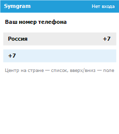
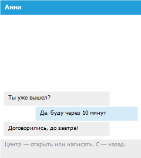
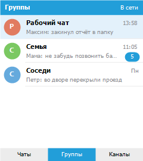
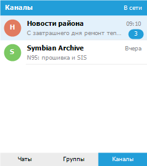
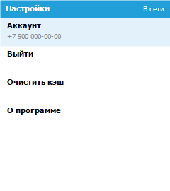

# Symgram

Нативный клиент Telegram для **Nokia N95 8GB** (Symbian OS 9.2 / S60 3rd Edition FP1).
Текущая версия — **0.2.12**.

<br clear="left">

Приложение на Symbian C++: вход в облачный аккаунт, список диалогов с превью,
отправка текста, эмодзи и файлов, управление с клавиатуры и джойстика. Иконка и
шапка — фирменный синий Telegram (`#229ED9`) в рамках привычек S60.

Полное техническое задание — в [docs/SPEC.md](docs/SPEC.md).

## Состояние

На устройстве работает мессенджер, а не оболочка. Проверено на N95 8GB.

- Вход по номеру, коду из SMS / Telegram и облачному паролю (2FA).
- Сессия сохраняется в `session.bin` и переживает закрытие приложения.
- Список чатов с превью последнего сообщения; кэш в приватном каталоге
  (`chats.bin`, `contacts.bin`).
- Вкладки **Чаты** | **Группы** | **Каналы**. Контакты и настройки — в меню «Опции».
- Отправка текста, эмодзи, фото и файлов; вложения открываются системными
  приложениями и сохраняются на диск.
- `FLOOD_WAIT` показывается как «Ждите Nh Nm», последний RPC при лимите не
  повторяется сам.

Картинки ниже — **макеты раскладки** скриптом `tools\preview-ui.ps1` по правилам
из `src/SymgramAppView.cpp`, не фотографии экрана N95. Эмулятор на современных
Windows не запускается. Данные в списках вымышленные, из `tools/mock-chats.txt`;
в сборку они не попадают.

| Вход | Чаты | Переписка |
| :---: | :---: | :---: |
|  |  |  |

| Группы | Каналы | Настройки |
| :---: | :---: | :---: |
|  |  |  |

### Что уже есть и чего нет

| Есть в 0.2.12 | Ещё нет |
| --- | --- |
| Авторизация, 2FA, выход | Секретные чаты |
| Личные чаты, группы, супергруппы, каналы | Поиск, архив, закрепление |
| Текст, эмодзи, фото, файлы | Видео, голосовые, реакции |
| Контакты, настройки, очистка кэша | Фоновые уведомления |
| Кэш диалогов и истории на диске | Проверка обновлений с GitHub |

Критерии первой версии по ТЗ — в разделе 11 [спецификации](docs/SPEC.md). Часть из них
уже закрыта, часть (поиск, медиа кроме фото/файлов, уведомления) остаётся впереди.

## Управление на N95

| Клавиша | Действие |
| --- | --- |
| Вверх / вниз | Список, поля входа, пункты настроек |
| Влево / вправо | Вкладки Чаты / Группы / Каналы; страна на экране входа |
| Центр джойстика | Открыть чат, подтвердить, отправить |
| C / назад | Назад из переписки, контактов и настроек |
| Левая софт-клавиша | Меню «Опции» (контакты, настройки, эмодзи, фото) |

## Целевая платформа

| Параметр | Значение |
| --- | --- |
| Устройство-референс | Nokia N95 8GB |
| Операционная система | Symbian OS 9.2 |
| Интерфейсная платформа | S60 3rd Edition FP1 |
| Клиентская область | 240 × 270 под статус-строкой и софт-клавишами (экран 240 × 320) |
| Управление | клавиатура, джойстик, софт-клавиши; без сенсора |
| Поставка | самоподписанный `.sisx` |
| Версия | 0.2.12, UID `0xE0A11E95` |

UID из незащищённого диапазона, права `NetworkServices`, `ReadUserData`,
`WriteUserData` и `UserEnvironment` выдаёт пользователь при установке — Symbian Signed
не нужен.

## Технические решения

Исследование совместимости — в [docs/ARCHITECTURE.md](docs/ARCHITECTURE.md). Часть
ранних выводов (Open C / OpenSSL, SQLite, mbedTLS) **не вошла в текущую сборку**:
на N95 они либо не нужны, либо слишком тяжелы. Сейчас так:

| Задача | Как сделано |
| --- | --- |
| Криптография MTProto 2.0 | Свой код в `src/SymgramCrypto.cpp`: AES-256-IGE, SHA-1/256/512, RSA, DH, PBKDF2 для 2FA |
| Транспорт | Обычный TCP (`RSocket`); MTProto не использует TLS |
| Слой API | Layer 158, как tdesktop 4.8.3 |
| Локальные данные | Файлы в приватном каталоге приложения, не SQLite |
| Стек процесса | 64 КБ (`EPOCSTACKSIZE 0x10000`); больше — часть телефонов даёт 8 КБ и падает |
| Куча | до 8 МБ; крупные буферы на куче, не на стеке |

RPC идёт по одному (`iBusy`). Неизвестные `Updates` после входа не рвут сокет.
Лимит Telegram `FLOOD_WAIT_N` запоминается и блокирует повтор `getDialogs` / `sendCode`,
пока не истечёт.

## Языки

Основной язык интерфейса — русский, дополнительный — английский. Строки в
`data/Symgram_16.rls` и `data/Symgram_01.rls`; `data/Symgram.rls` выбирает вариант
по языку телефона, по умолчанию — русский.

## Сборка

Запускать из **`cmd.exe`**, не из PowerShell — причина в [docs/TOOLCHAIN.md](docs/TOOLCHAIN.md).

```
tools\release.bat            REM сборка под устройство и упаковка в .sisx
tools\build.bat gcce urel    REM только сборка, GCCE release
tools\package.bat            REM только упаковка и подпись
```

`package.bat` при первом запуске создаёт сертификат для самоподписи и дальше
переиспользует его; сертификат и ключ в репозиторий не попадают. Готовый пакет —
`sis/Symgram.sisx`.

Вспомогательные скрипты (PowerShell):

```
tools\make-icon.ps1
tools\preview-ui.ps1 -Screen signin
tools\preview-ui.ps1 -Screen chats
tools\preview-ui.ps1 -Screen groups
tools\preview-ui.ps1 -Screen channels
tools\preview-ui.ps1 -Screen settings
tools\preview-ui.ps1 -Screen chat
```

| Компонент | Версия |
| --- | --- |
| SDK | S60 3rd Edition FP1 SDK for Symbian OS, for C++ |
| Компилятор для устройства | GCCE — GCC 3.4.3, CodeSourcery ARM Q1C 2005 |
| Perl | ActivePerl 5.6.1 |

**Сборка под эмулятор недоступна.** Цель WINSCW требует Metrowerks CodeWarrior из
Carbide.c++, а сам эмулятор падает на современных Windows. Проверка — на устройстве.

## Установка на телефон

Телефон по умолчанию отвергает самоподписанные пакеты. Две настройки в диспетчере
приложений и разбор типичных сбоев — в [docs/DEVICE.md](docs/DEVICE.md).

Самоподписанное обновление поверх старой установки часто оставляет мёртвый
исполняемый файл. **Сначала удалите предыдущий Symgram**, затем ставьте новый
`.sisx`. Не открывайте приложение повторно, если сервер ответил `FLOOD_WAIT`:
лимит может растянуться на часы.

## Структура

```
group/       bld.inf и файл проекта .mmp
inc/         заголовки
src/         исходники (UI, MTProto, криптография, кэш)
data/        ресурсы .rss и строки локализации .rls
gfx/         исходники иконки
sis/         сценарий упаковки .pkg и готовый .sisx
tools/       сборка, упаковка, иконка, макеты экранов
docs/        ТЗ, архитектура, окружение, установка
```

## Выпуск версий

Каждая версия помечается тегом `vX.Y.Z`. Номер должен совпадать в
`inc/SymgramVersion.h`, заголовке `sis/Symgram.pkg` и строке «О программе».
История изменений — в [CHANGELOG.md](CHANGELOG.md).

## Документация

- [docs/SPEC.md](docs/SPEC.md) — техническое задание.
- [docs/ARCHITECTURE.md](docs/ARCHITECTURE.md) — исследование платформы (часть решений
  с тех пор изменена, см. таблицу выше).
- [docs/TOOLCHAIN.md](docs/TOOLCHAIN.md) — окружение сборки.
- [docs/DEVICE.md](docs/DEVICE.md) — установка на Nokia N95 8GB.
